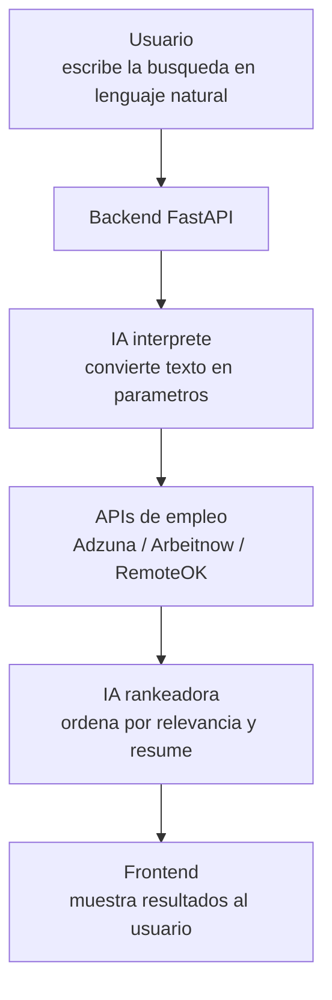

# Arquitectura

## Flujo general



## Decisiones de diseno

| Decision | Por que |
|---|---|
| FastAPI en vez de Flask/Django | Async nativo (importante porque llamamos APIs externas), validacion automatica con Pydantic, documentacion interactiva gratis en `/docs` |
| SQLite en vez de Postgres | Cero configuracion para un proyecto local; migracion a Postgres es trivial si se despliega despues |
| Multiples fuentes de empleo | Ninguna API cubre el mercado completo; combinar fuentes aumenta cobertura |
| IA en dos etapas (interpretar + rankear) | Separa dos responsabilidades distintas: entender la intencion del usuario, y evaluar relevancia de resultados. Cada prompt es mas simple y facil de depurar por separado |
| `salary_disclosed` como booleano explicito | Es mas honesto mostrar "no especificado" que inventar un valor o esconder la ausencia del dato |

## Estructura de carpetas

```
backend/app/
├── models/      # Contratos de datos (Pydantic schemas)
├── services/    # Logica de negocio: conectores a fuentes externas + IA
├── routes/      # Endpoints HTTP
└── db/          # Persistencia local (SQLite)
```

Cada carpeta tiene una unica responsabilidad. Esto facilita que el proyecto
crezca sin volverse dificil de mantener (principio de "separation of concerns").
